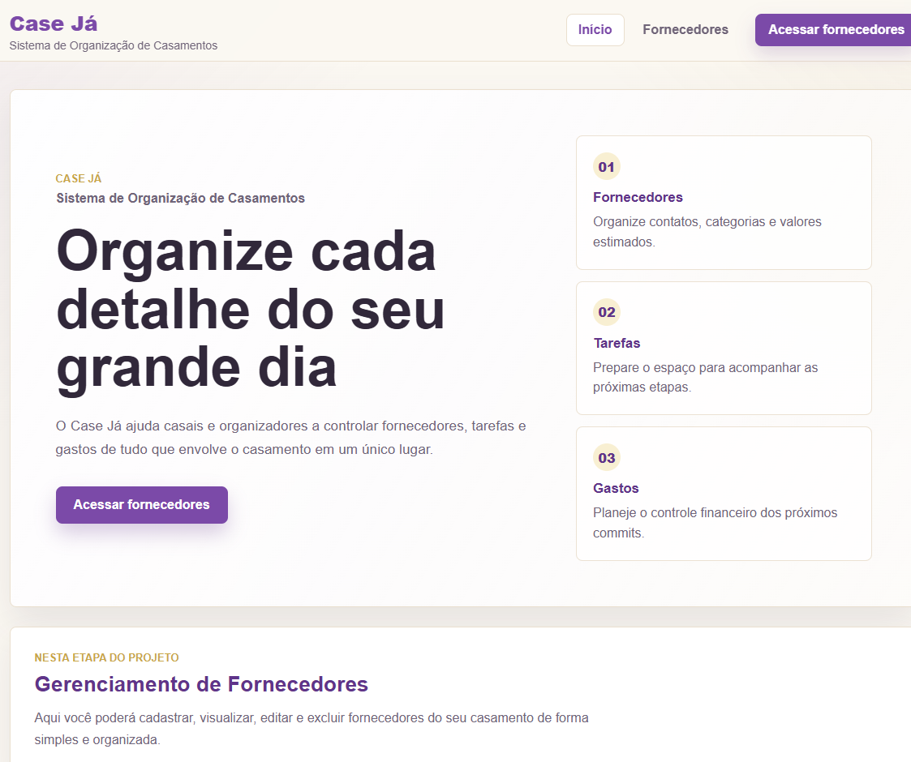
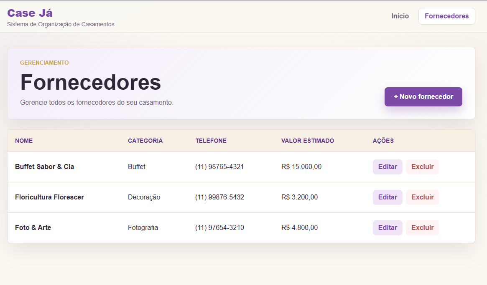
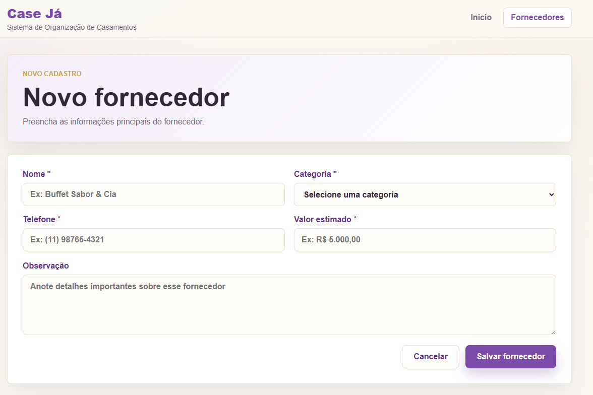
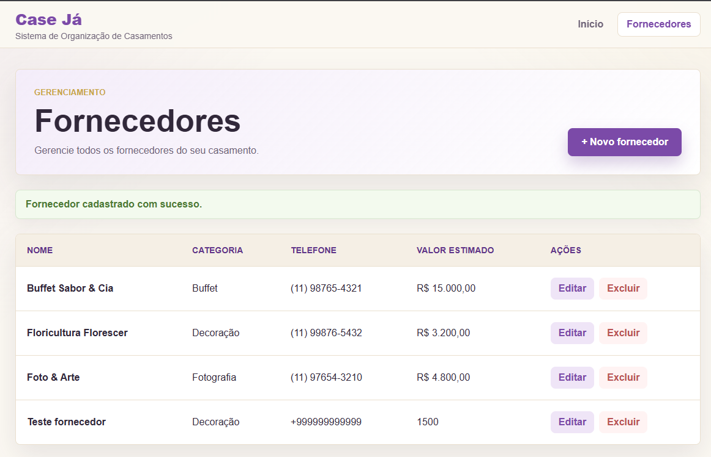
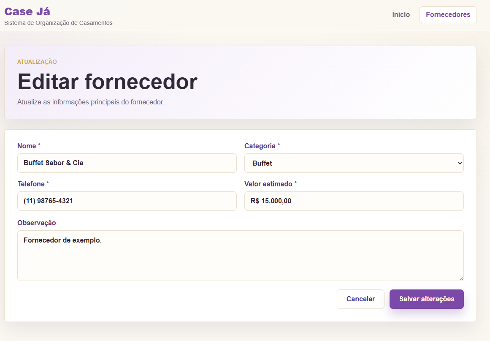
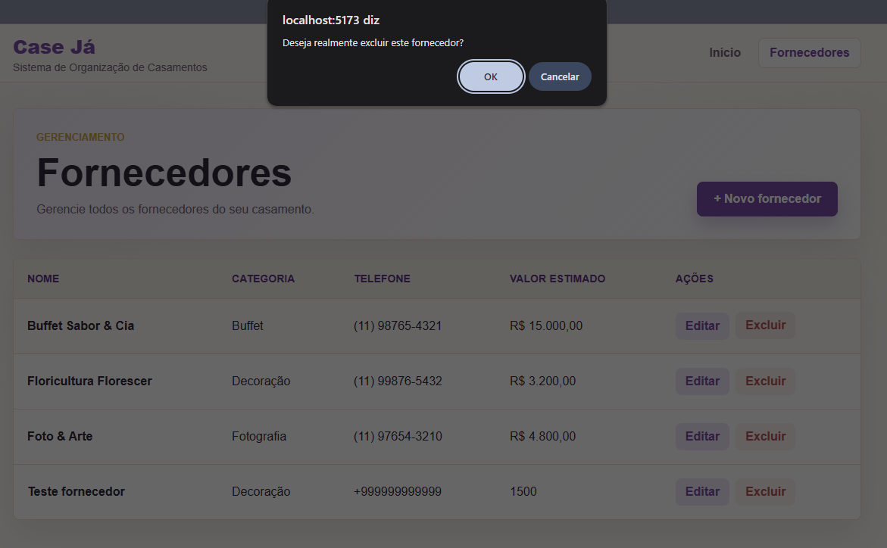

# Case Já – Sistema de Organização de Casamentos

## Integrantes

- João Pedro Almeida
- Felipe Gabriel

## Descrição do Sistema

O Case Já é um sistema desenvolvido para auxiliar casais e organizadores de eventos na organização de casamentos.

Nesta etapa do projeto, foi desenvolvido um fluxo funcional de gerenciamento de fornecedores. O usuário pode cadastrar, visualizar, editar e excluir fornecedores relacionados ao casamento, mantendo as informações organizadas em um único lugar.

## Tecnologias Utilizadas

- HTML
- CSS
- JavaScript
- React
- Vite
- Git
- GitHub
- LocalStorage

## Funcionalidades Implementadas

- Tela inicial do sistema
- Tela de fornecedores
- Cadastro de fornecedores
- Listagem de fornecedores
- Edição de fornecedores
- Exclusão de fornecedores
- Validação de campos obrigatórios
- Salvamento dos dados no navegador com localStorage
- Layout responsivo

## Como Executar o Projeto

1. Acesse a pasta do projeto:

```bash
cd codigo-fonte/case-ja
```

2. Instale as dependências:

```bash
npm install
```

3. Execute o projeto:

```bash
npm run dev
```

4. Abra o endereço exibido no terminal no navegador.

## Repositório GitHub

Colocar o link do repositório aqui:

```txt
https://github.com/Jpadoliveiragit/CaseJa
```

## Vídeo de Demonstração

[Acessar vídeo de demonstração](https://drive.google.com/file/d/1ukMUiyIzlUfjwUyYyLYK4Gwwfe9kxwbL/view?usp=sharing)

## Evidências do Projeto

### Tela inicial



### Listagem de fornecedores



### Cadastro de fornecedor



### Fornecedor cadastrado



### Edição de fornecedor



### Confirmação de exclusão de fornecedor



## Divisão das Atividades

| Integrante         | Atividades desenvolvidas                                                                 |
| ------------------ | ---------------------------------------------------------------------------------------- |
| João Pedro Almeida | Estrutura do projeto, telas principais, layout, README e organização das evidências      |
| Felipe Gabriel     | Lógica do CRUD, armazenamento no localStorage, testes do fluxo e documento de requisitos |
